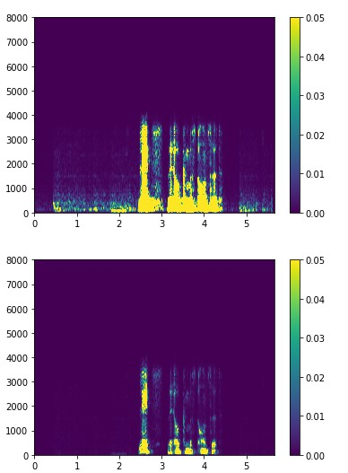
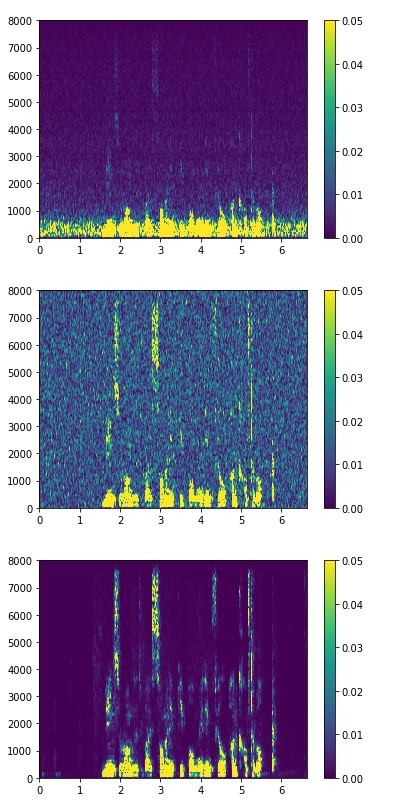
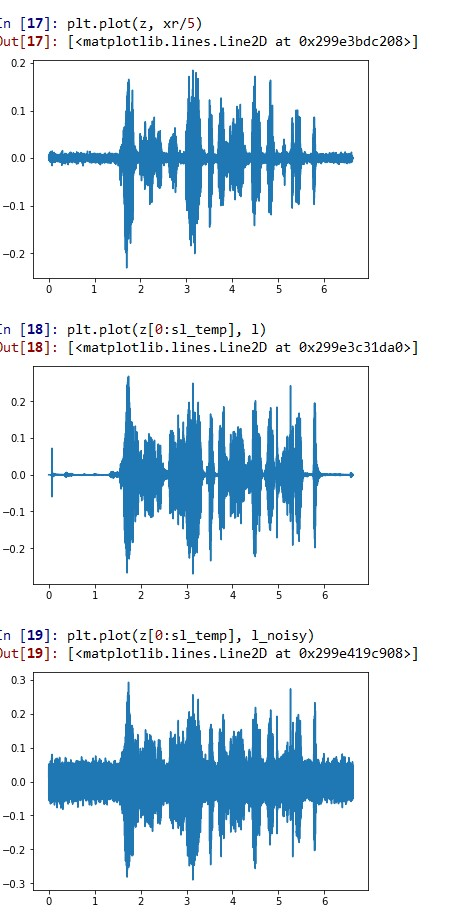

# Speech-Enhancement-Project-using-Deep-Learning
This repository has files to train a deep autoencoder on clean speech (from the mozilla common-voice dataset). Then adding gaussian noise to a file, taking its spectrum, and feeding it into the trained autoencoder, to see the result in frequency domain. It also contains a file to reconstruct the output of the autoencoder, writing it to a file for knowing the result of the enhancement provided by the autoencoder.

The file 'Manan_Code_Conversion_Spectrogram_Trials.py' will train the autoencoder using a concatenation of spectrums of clean speech files. It will train the deep autoencoder model. We will use 1000 common voice files to train the autoencoder model. First, we take the spectrogram of all the speech files, concatenate them to one big matrix, and then feed this matrix into the deep autoencoder model, the layers of which are constructed using Keras from Tensorflow. We save the trained model as 'AE_1000.hdf5'.

These two images are just the original spectrum, and predicted spectrum for the same file used for training, just a little test. A much better test will be on the test set, in the next set of images.

The file 'Noisy_Data_in_AE.py' is to test our trained model. It will take a particular file, that was not present in the training set, add gaussian noise to it, and feed its spectrum to the trained autoencoder, then, take its prediction, adjust the prediction a little bit and plot the noisy file spectrogram, original clean file spectrogram, and the predicted file spectrogram. 

The image in the middle is the noisy spectrum (spectrum corrupted by Gaussian noise), the image at the bottom is the original spectrum, and the top image is the enhanced spectrum. We can see the reduction in noise in the spectrum.

The file 'Reconstruction_and_write_to_mp3_playground.py' will reconstruct the signal from the output spectrogram, so that it can be played and compared with the original file. In the code in this file, we first take the inverse fourier transform of the predicted spectrogram, and thus, take it into the time domain. Then, we plot it in the time domain, along with the waveforms of the original and noisy signals. We also save the waveform as 'reconstructed_150.wav', so that it can be played and listened to, and so that its quality can be compared with the noisy and original files. The noisy file is saved as 'noisy_150.wav', and the original file as 'original_150.wav'.

The top waveform is for the enhanced sound. In the middle, is the original, and at the bottom is the noisy one.

The files must be run in the order in which their names are mentioned, and the workspace should not be cleaned after running each file.

This repository is the first part of a large work project done by me.

-Manan sheel.
